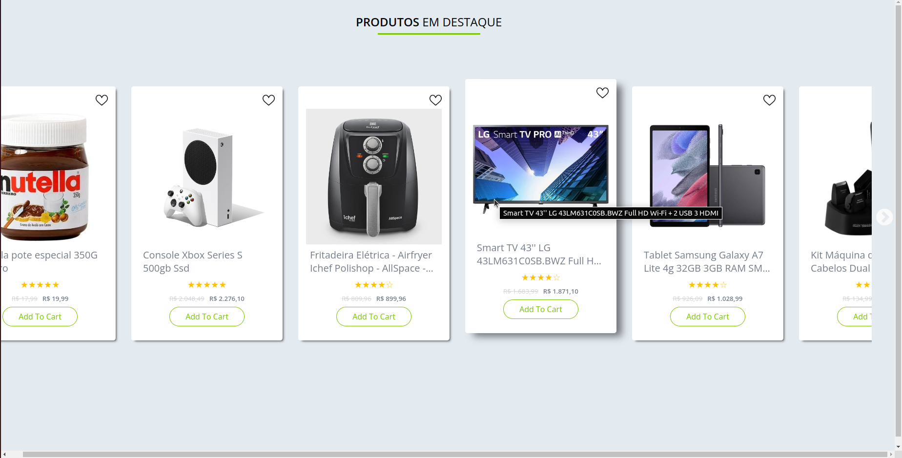
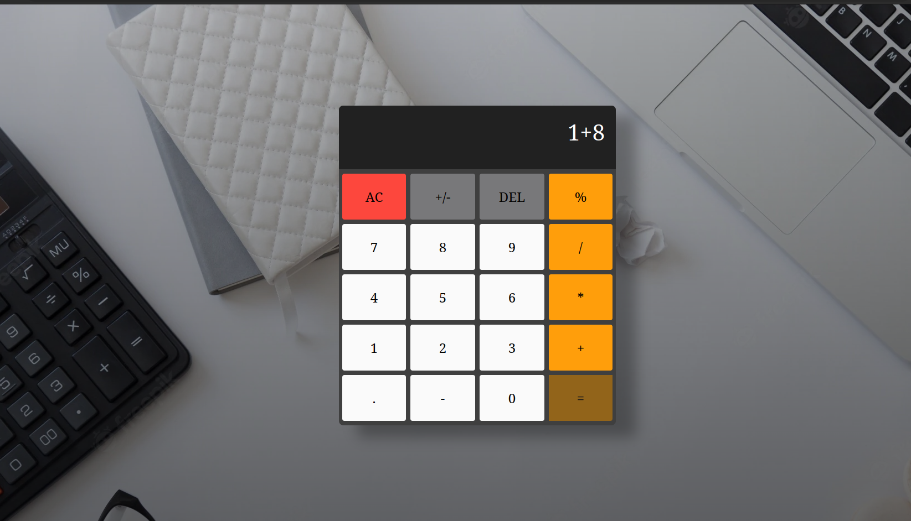

# learning-code
This repository will be for me add what i am currently learning, examples of this are projects made with JavaScript,HTML,CSS,Node,APIs and etc...
Here are some examples of what i did:

1º Slide shop: https://github.com/Willian1661/learning-code/tree/master/code_projects/%C2%BAslideshop
 
 

||

\\/

2º Calculator: https://github.com/Willian1661/learning-code/tree/master/code_projects/%C2%BAcalculate
 
 
  

||

\\/

3º Country Guide: https://github.com/Willian1661/learning-code/tree/master/code_projects/%C2%BAcountryGuide
 
 

||

\\/

4º Resume structure example: https://github.com/Willian1661/learning-code/tree/master/code_projects/%C2%BAcurriculum

!!Its based on eerison's project: https://github.com/shield-wall/CurriculumBundle !!

||

\\/
