# learning-code   
This repository will be for me add what i am currently learning, examples of this are projects made with JavaScript,HTML,CSS,Node,APIs and etc...
Here are some examples of what i did:

**1º Slide shop: https://github.com/Willian1661/learning-code/tree/master/code_projects/%C2%BAslideshop**
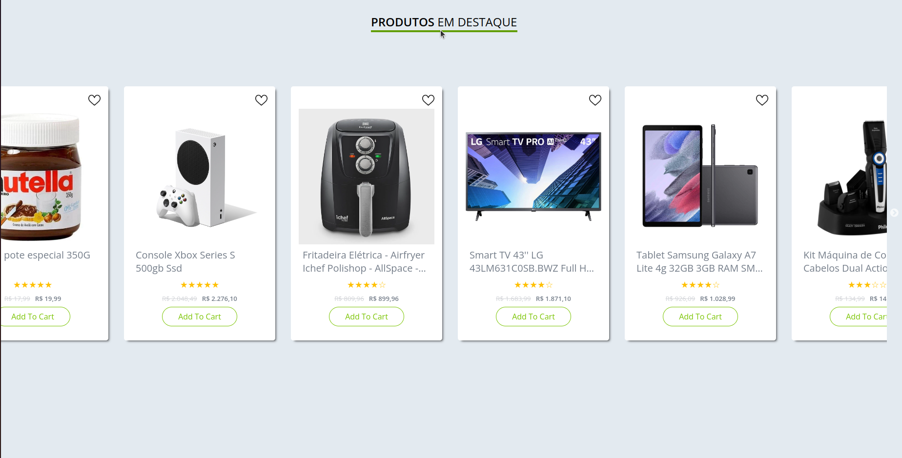 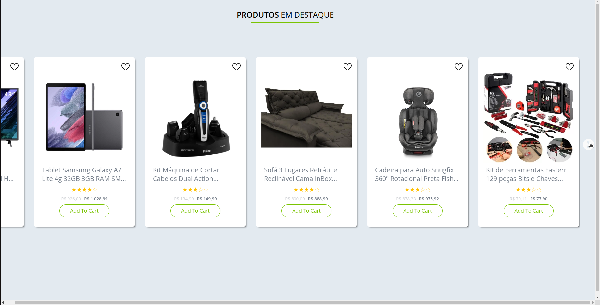
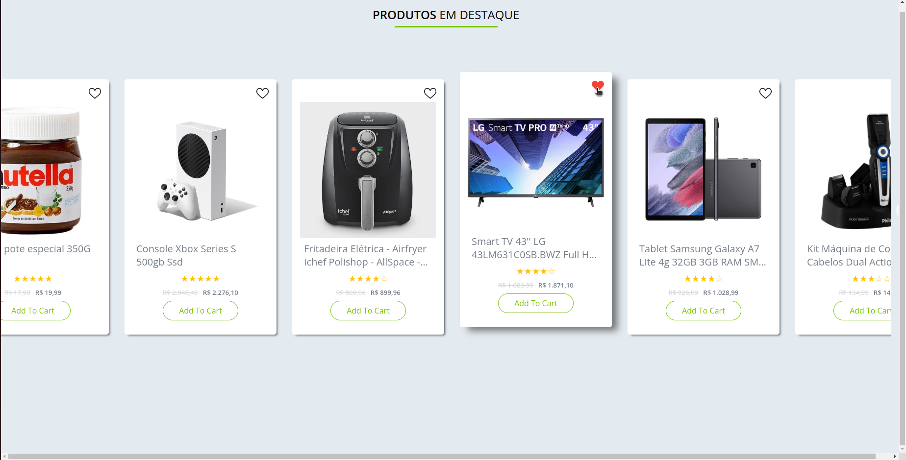
## Front end:
- HTML / CSS / JS 

- Jquery

- API

- Slick Carrousel

**2º Weather app: https://github.com/Willian1661/learning-code/tree/master/code_projects/%C2%BAweatherApp**
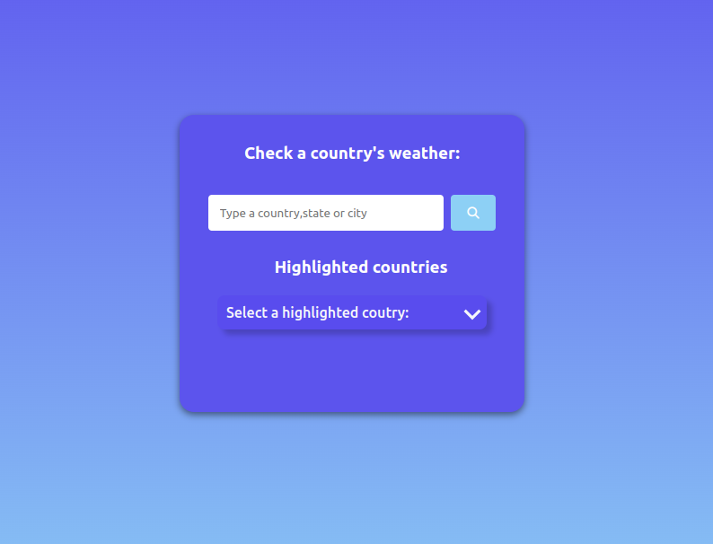 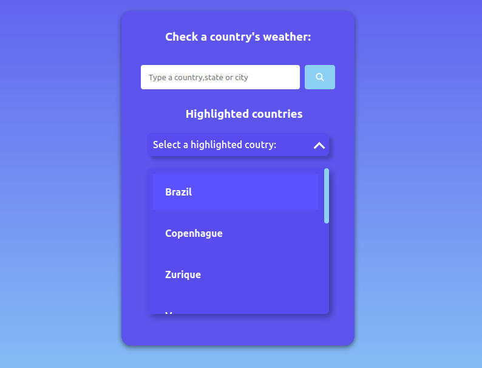
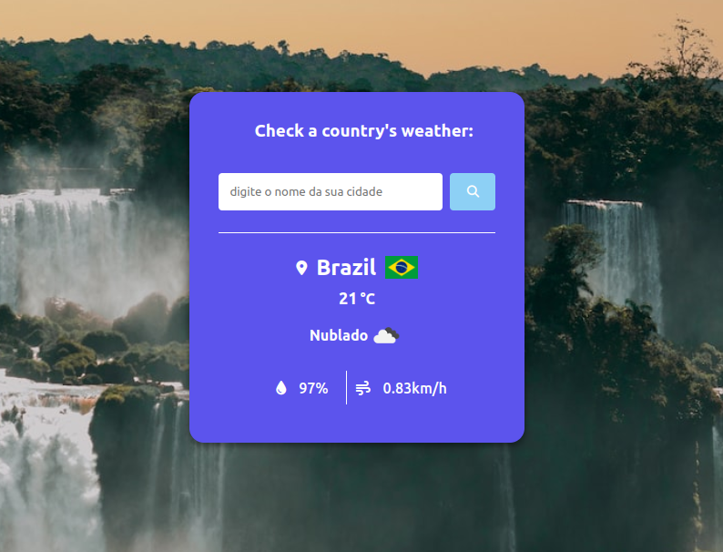 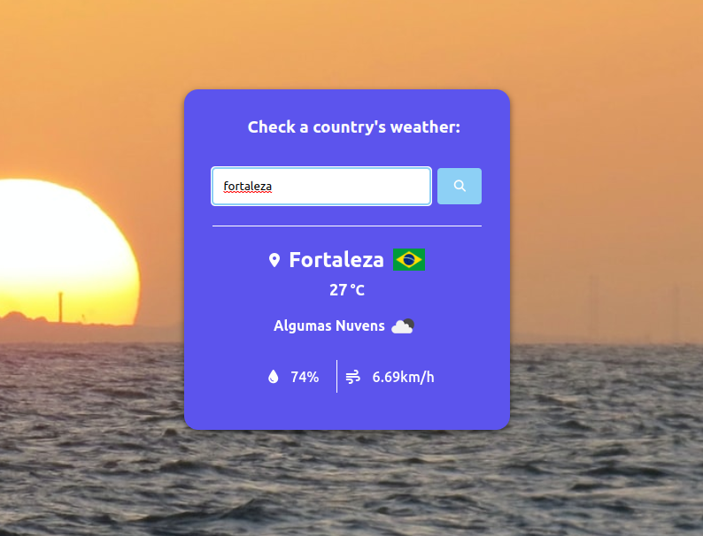
## Front end:
- HTML / CSS / JS 

- API

**3º Search Recepe: https://github.com/Willian1661/learning-code/tree/master/code_projects/%C2%BAsearchRecepe**

 
 
## Front end:
- HTML / CSS / JS 

- Jquery

- API

**4º JogoDaVelha: https://github.com/Willian1661/learning-code/tree/master/code_projects/%C2%BAjogoVelha**
  
 
## Front end:
- HTML / CSS / JS 

**5º Calculator:https://github.com/Willian1661/learning-code/tree/master/code_projects/%C2%BAcalculate**
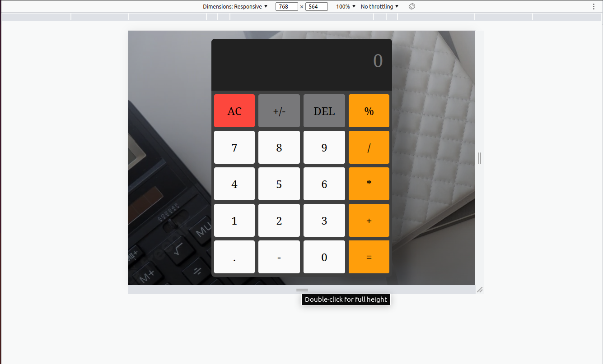 
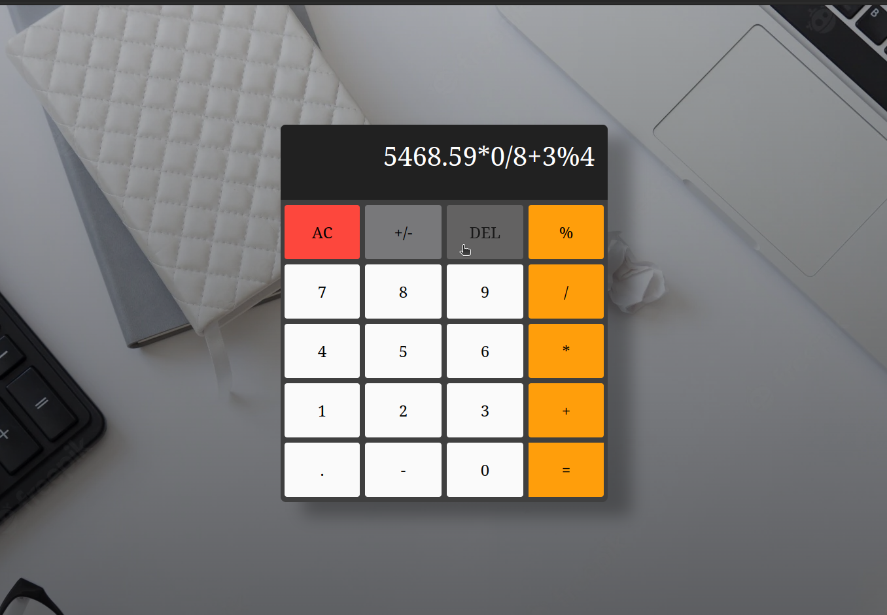 
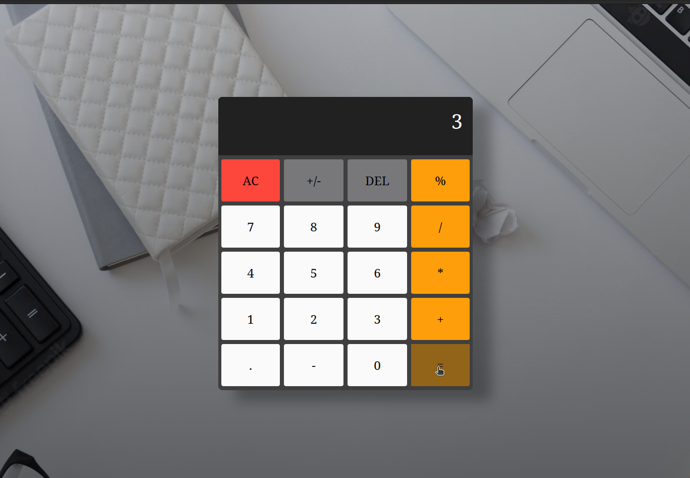 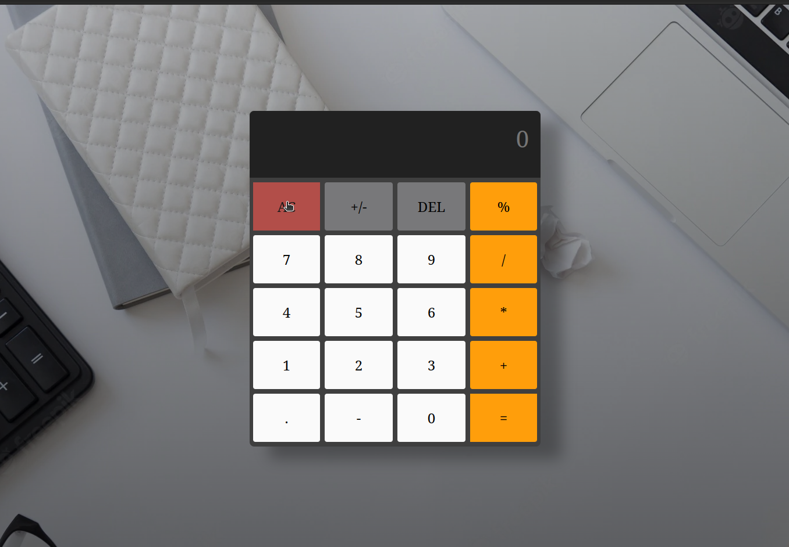
## Front end:
- HTML / CSS / JS 

**6º Country Guide: https://github.com/Willian1661/learning-code/tree/master/code_projects/%C2%BAcountryGuide**

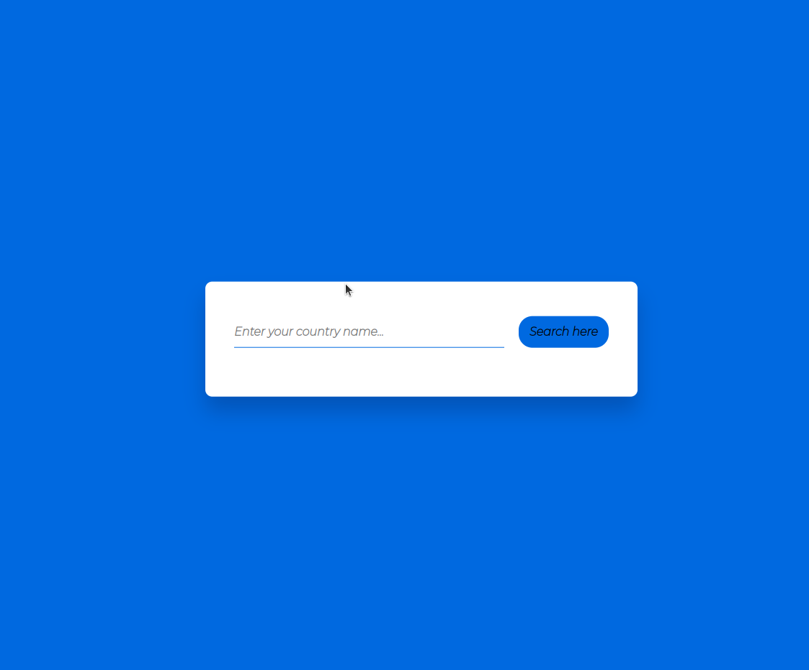 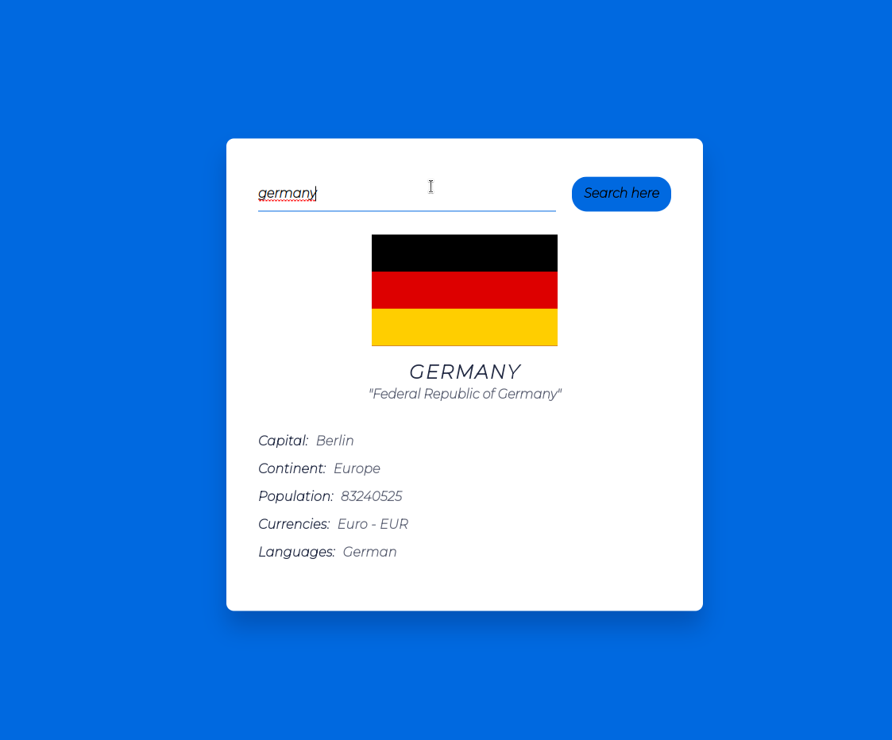
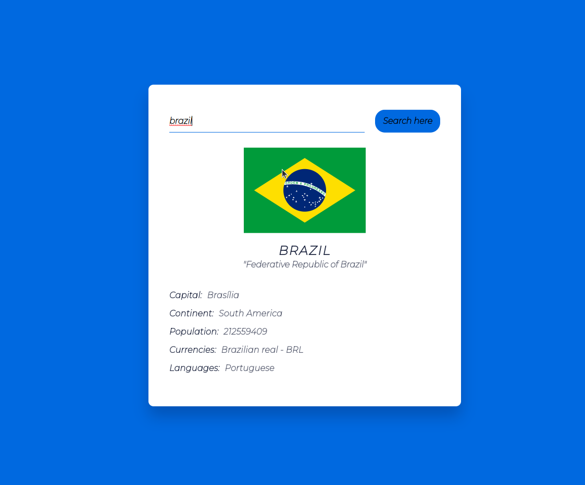 
## Front end:
- HTML / CSS / JS 

- Jquery

- API

**7º Resume structure example: https://github.com/Willian1661/learning-code/tree/master/code_projects/%C2%BAcurriculum**

***!!Its based on eerison's project: https://github.com/shield-wall/CurriculumBundle !!***

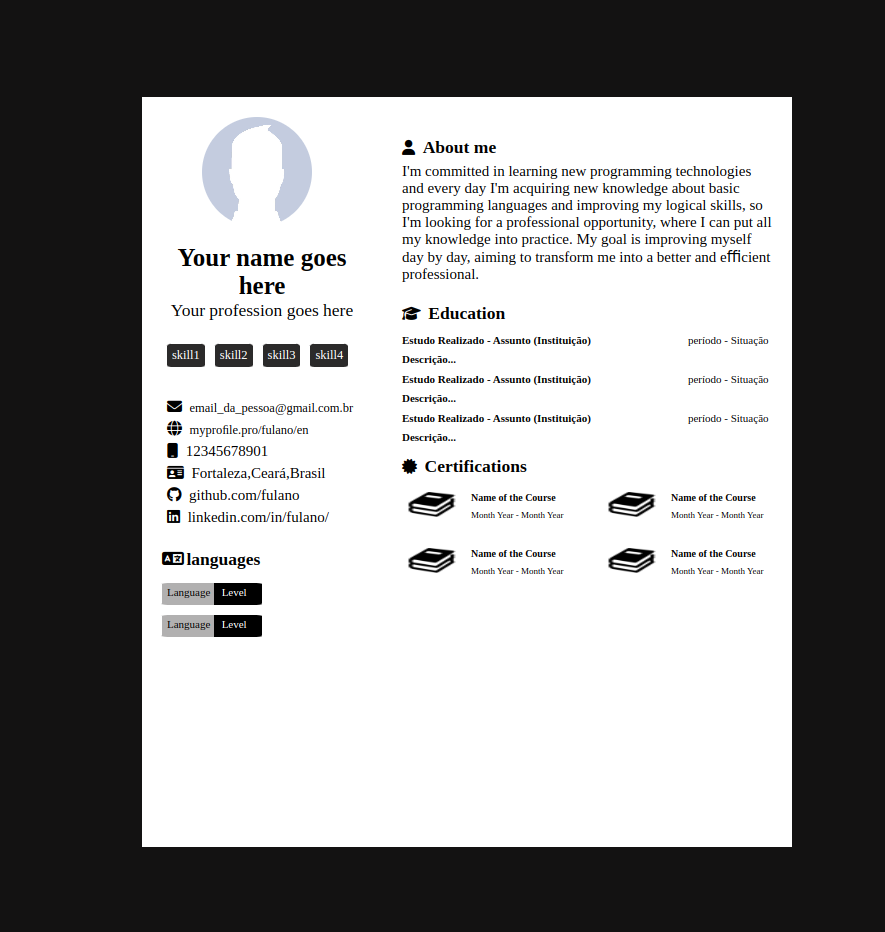

## Front end:

- HTML / CSS

