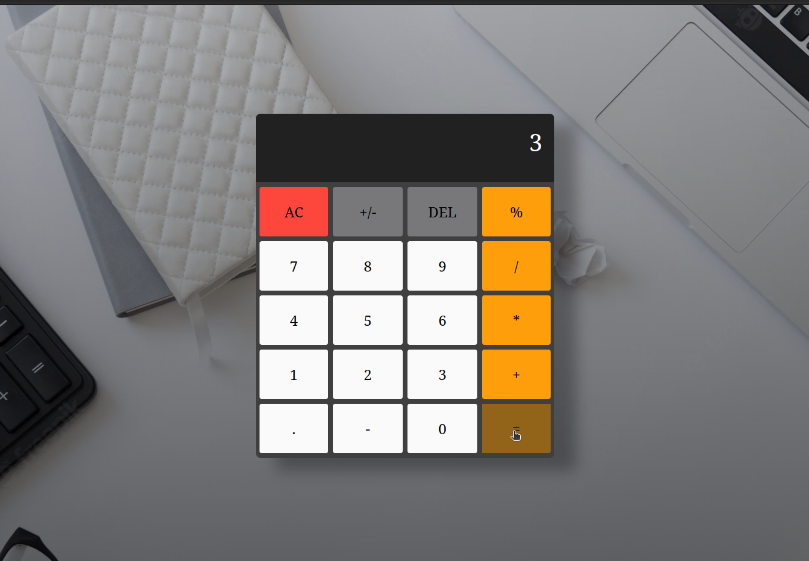

# learning-code   
This repository will be for me add what i am currently learning, examples of this are projects made with JavaScript,HTML,CSS,Node,APIs and etc...
Here are some examples of what i did:

**1º [Slide shop](https://github.com/Willian1661/learning-code/tree/master/code_projects/%C2%BAslideshop)**

## Front end:
- HTML / CSS / JS 

- API

- Slick Carrousel

**2º [Weather app](https://github.com/Willian1661/learning-code/tree/master/code_projects/%C2%BAweatherApp)**

 
 
## Front end:
- HTML / CSS / JS 

- API

**3º [Search Recepe](https://github.com/Willian1661/learning-code/tree/master/code_projects/%C2%BAsearchRecepe)**

 
 

## Front end:
- HTML / CSS / JS 

- API

**4º [JogoDaVelha](https://github.com/Willian1661/learning-code/tree/master/code_projects/%C2%BAjogoVelha)**

  
 

## Front end:
- HTML / CSS / JS 

**5º [Calculator](https://github.com/Willian1661/learning-code/tree/master/code_projects/%C2%BAcalculate)**

 
 
 

## Front end:
- HTML / CSS / JS 

**6º [Country Guide](https://github.com/Willian1661/learning-code/tree/master/code_projects/%C2%BAcountryGuide)**

 
 

## Front end:
- HTML / CSS / JS 

- API

**7º [Resume structure example](https://github.com/Willian1661/learning-code/tree/master/code_projects/%C2%BAcurriculum)**

***!!Its based on [eerison's project](https://github.com/shield-wall/CurriculumBundle)!!***

## Front end:

- HTML / CSS

